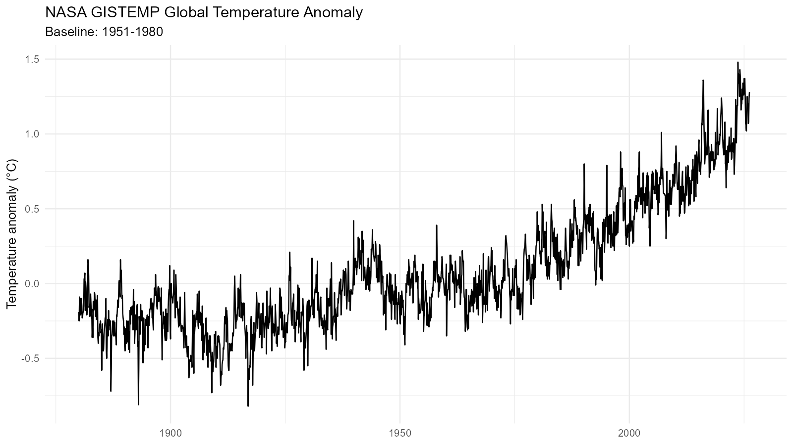
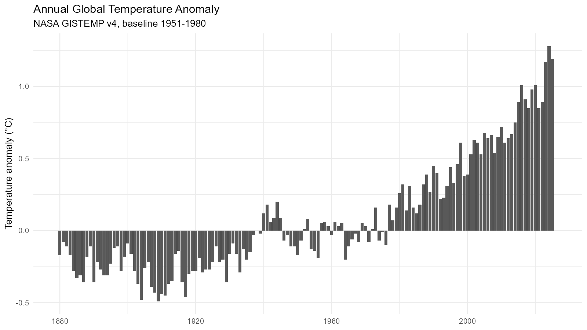
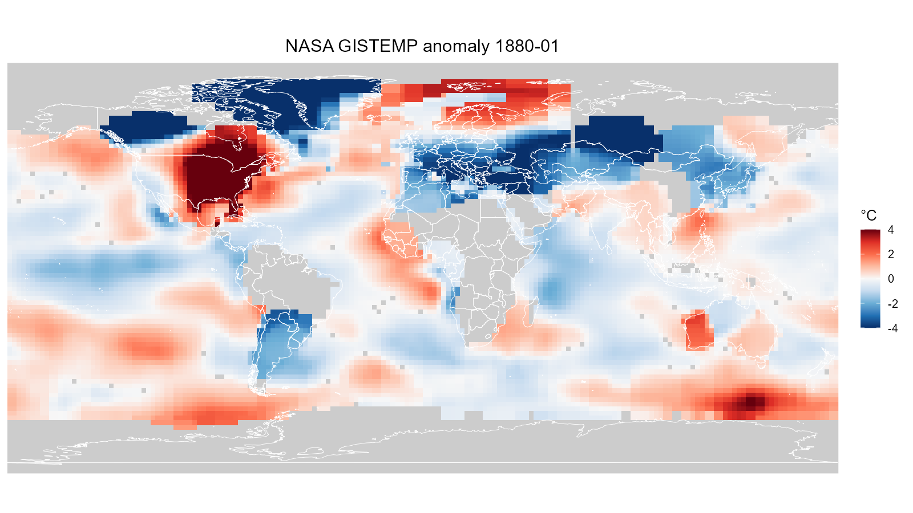
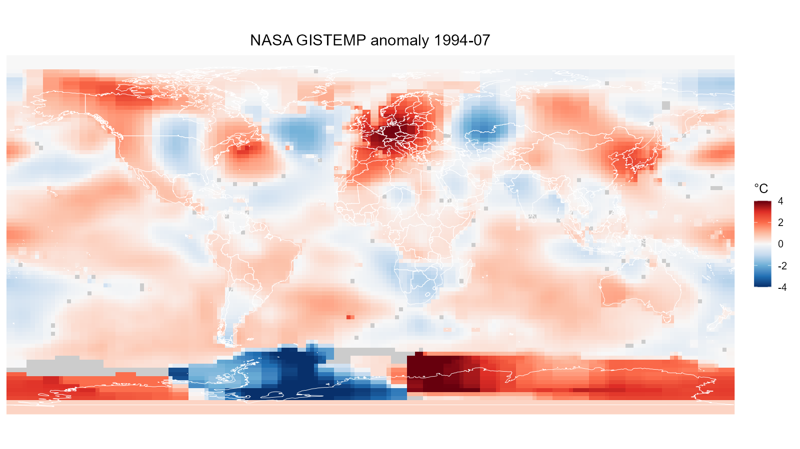
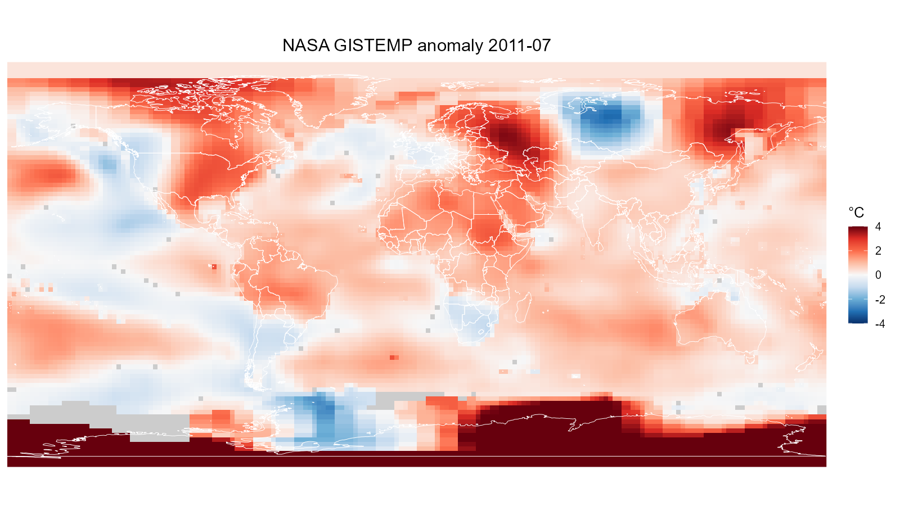
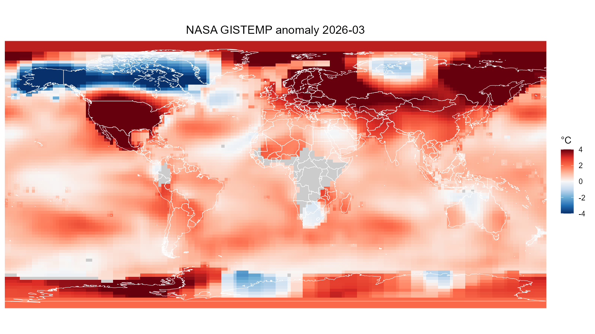

# Global warming visualization

  
  

  
  
  
  

  

---

## Data set  

url_global  
"https://data.giss.nasa.gov/gistemp/tabledata_v4/GLB.Ts+dSST.csv"  

url_nc_gz  
"https://data.giss.nasa.gov/pub/gistemp/gistemp1200_GHCNv4_ERSSTv5.nc.gz"

